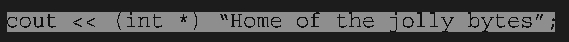
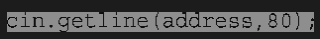
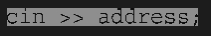

# 复习题
### 1.如何声明下述数据?
#### a. actor是由30个char组成的数组
#### b. betsie是由100个short组成的数组
#### c.chuck是由13个float组成的数组
#### d.dispea是由64个long double组成的数组
```C++
a.
char actor[30];
b.
short betsie[100];
c.
float chuck[13];
d.
long double dispea[64];
```
### 2．使用模板类array而不是数组来完成问题1
```C++
a.
std::array<char, 30> actor;
b.
std::array<short, 100> betsie;
c.
std::array<float, 13> chuck;
d.
std::array<long double, 64> dispea;
```

### 3．声明一个包含5个元素的int数组,并将它初始化为前5个正奇数
```C++
int jishu[5] = {1,3,5,7,9};
```
### 4．编写一条语句,将问题3中数组第一个元素和最后一个元素的和赋值给变量even
```C++
int even = jishu[0]+jishu[4];
```
### 5．编写一条语句,显示float数组ideas中的第二个元素的值
```C++
cout << ideas[1] << endl;
```
### 6. 声明一个char的数组,并将其初始化为字符串"cheeseburger"
```C++
char myArray[] = "cheeseburger";
```
### 7．声明一个string对象,并将其初始化为字符串"Waldorf Salad"
```C++
std::string salad = "Waldorf Salad";
```
### 8．设计一个描述鱼的结构声明.结构中应当包括品种,重量(整数,单位为蛊司)和长度(英寸,包括小数)
```C++
#include <string>
struct Fish {
    std::string variety;
    int weight;
    double length;
};
```
### 9．声明一个问题8中定义的结构的变量,并对它进行初始化
```C++
#include <string>
struct Fish {
    std::string variety;
    int weight;
    double length;
};
Fish myFish = {"stonefish", 2, 5.5};
```
### 10．用enum定义一个名为Response的类型,它包含Yes,No和Maybe等枚举量,其中Yes的值为1,No为0,Maybe为2
```C++
enum Response {
    No = 0,
    Yes = 1,
    Maybe = 2
};
```
### 11.假设ted是一个double型变量,请声明一个指向ted的指针,并使用该指针来显示ted的值
```C++
#include <iostream>
int main() {
    double ted;
    std::cout << "Enter the ted: ";
    std::cin >> ted;
    double* pted = &ted;
    std::cout << "The ted is: " << *pted << std::endl;
    return 0;
}
```

### 12．假设treacle是一个包含10个元素的float数组，请声明一个指向treacle的第一个元素的指针，并使用该指针来显示数组的第一个元素和最后一个元素。
```C++
float treacle[10];
float* p = treacle;
std::cout << "The first element is: " << *p << std::endl;
float* p = treacle + 9;
std::cout << "The last element is: " << *p << std::endl;
```
### 13．编写一段代码，要求用户输入一个正整数，然后创建一个动态的int数组，其中包含的元素数目等于用户输入的值。首先使用new来完成这项任务，再使用vector对象来完成这项任务。
```C++
                         1.用new:

#include <iostream>
int main() {
    int num;
    std::cout << "输入一个正整数:";
    std::cin >> num;
    if (num <= 0) {
        std::cout << "输入错误!" << std::endl;
        return 1;
    }
    int* pnum = new int[num];
    for (int i = 0; i < num; ++i) {
        pnum[i] = i;
    }
    std::cout << num <<"个元素分别是:";
    for (int i = 0; i < num; ++i) {
        std::cout << pnum[i] << " ";
    }
    std::cout << std::endl;
    delete[] pnum;
    return 0;
}


                         2.用vector:

#include <iostream>
#include <vector>
int main() {
    int n;
    std::cout << "请输入一个正整数：";
    std::cin >> n;
    if (n <= 0) {
        std::cout << "输入的不是正整数，请重新输入。" << std::endl;
        return 1;
    }
    std::vector<int>  vnum(n);
    for (int i = 0; i < n; ++i) {
        vnum[i] = i;
    }
    std::cout << "数组内容：";
    for (int i = 0; i < n; ++i) {
        std::cout << vnum[i] <<" ";
    }
    std::cout << std::endl;
    return 0;
}
```
### 14．下面的代码是否有效？如果有效，它将打印出什么结果？

```C++
无效
```
### 15．编写一段代码，给问题8中描述的结构动态分配内存，再读取该结构的成员的值。
```C++
#include <iostream>
#include <string>
struct Fish {
    std::string species;
    int weight;
    double length;
};
int main() {
    Fish* myFish = new Fish;
    std::cout << "请输入鱼的品种: ";
    std::getline(std::cin, myFish->species);
    std::cout << "请输入鱼的重量（盎司）: ";
    std::cin >> myFish->weight;
    std::cin.ignore();
    std::cout << "请输入鱼的长度（英寸）: ";
    std::cin >> myFish->length;
    std::cout << "您输入的鱼信息如下:" << std::endl;
    std::cout << "品种: " << myFish->species << std::endl;
    std::cout << "重量: " << myFish->weight << " 盎司" << std::endl;
    std::cout << "长度: " << myFish->length << " 英寸" << std::endl;
    delete myFish;
    return 0;
}
```
### 16．程序清单4.6指出了混合输入数字和一行字符串时存储的问题。如果将下面的代码：

### 替换为：

### 将对程序的运行带来什么影响？
```C++
会正常运行,相当于在getline之前加上一个cin.ignore(),
因为cin>>address不会因为遇到换行导致丢失读取
```
### 17．声明一个vector对象和一个array对象，它们都包含10个string对象。指出所需的头文件，但不要使用using。使用const来指定要包含的string对象数。
```C++
#include <vector>
#include <array>
#include <string>
int main() {
    const num = 10;
    std::vector<std::string> vStrings(num);
    std::array<std::string, num> aStrings;
    return 0;
}
```


<br>
<br>
<br>
<br>
<br>

####  2024/11/16