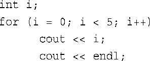
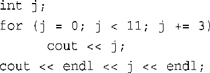
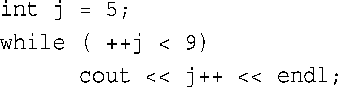
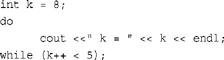
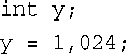

# 复习题
### 1.入口条件循环和出口条件循环之间的区别是什么？各种C++循环分别属于其中的哪一种？
#### 
```C++
入口条件循环会首先判断条件是否符合,然后再执行循环
出口条件循环会首先执行一次代码块,再判断条件是否符合执行循环
for和while都是入口条件循环,do while是出口条件循环.
```
### 2．如果下面的代码片段是有效程序的组成部分，它将打印什么内容？

```C++
0
1
2
3
4
```

### 3．如果下面的代码片段是有效程序的组成部分，它将打印什么内容？

```C++
0369
12

```
### 4．如果下面的代码片段是有效程序的组成部分，它将打印什么内容？

```C++
6
8
```
### 5．如果下面的代码片段是有效程序的组成部分，它将打印什么内容？

```C++
k = 8
```
### 6.编写一个打印1、2、4、8、16、32、64的for循环，每轮循环都将计数变量的值乘以2。
```C++
#include <iostream>
int main(){
	for (int i =1;i<=64;i*=2){
		std::cout<<i<<std::endl;
	}
	return 0;
}
```
### 7．如何在循环体中包括多条语句？
```C++
使用花括号
```
### 8．下面的语句是否有效？如果无效，原因是什么？如果有效，它将完成什么工作？

```C++
有效,
这是一个逗号运算符,最后面的表达式的值将会赋值给x,也就是024
但是由于024是一个8进制数,所以最终将会把十进制数20赋值给x
```
### 下面的语句又如何呢?

```C++
这条语句是无效的,
因为使用逗号运算符的时候需要将其用括号括起来,避免歧义
```
### 9．在查看输入方面，cin >>ch同cin.get(ch)和ch=cin.get( )有什么不同？
```C++
std::cin会读取一串字符,遇到空白字符是结束读取,并跳过空白字符
cin.get(ch)和ch=cin.get( )的作用是一样的都是读取下一个字符,
并将值存储在变量ch中,无论是否为空白字符.
```

<br>
<br>
<br>
<br>
<br>

####  2024/11/30